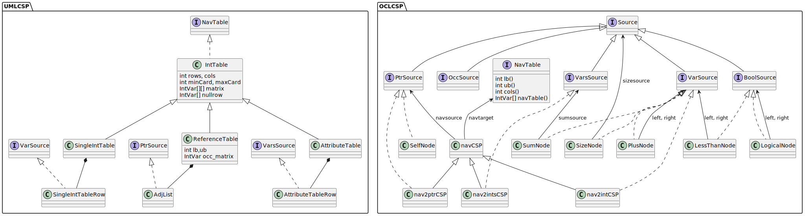
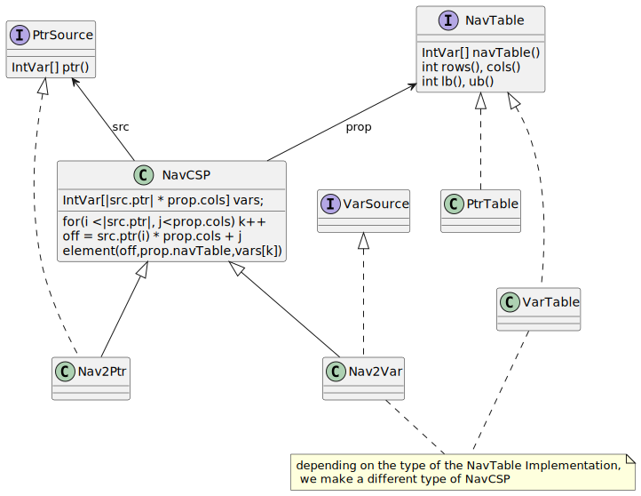

# OCL in Choco
AIMT : OCL 2 CSP 4 ATLc

**OCL AST nodes** and **UML Object Properties** modeled as **CSPs** using **Choco-Solver**

These semantics are used in [OOCP](https://github.com/ArtemisLemon/OOCP)'s compiler's Ecore+XMI and ATL-OCL interpreters.


## How get Lib
```bash
# download latest version
git submodule add git@github.com:ArtemisLemon/OCLinChoco.git OCLinChoco
# update
git submodule update --remote
```
```groovy
//add to settings.gradle
include('OCLinChoco')
//add to build.gradle
dependencies {
    implementation project(':OCLinChoco')
}
```

## Overview


We can split the models into **UML CSP** and **OCL CSP**, the former modeling what can be represented with a UML Instance Diagram, and the latter modeling OCL constraints applied to the instance.
Attributes and References have their models among the **UML CSP**, each OCL word - or AST node - has their own set of **OCL CSP** models.

Typing is represented by the `Source` interfaces. A `PtrSource` provides a collection of variables encoding pointers to objects of the problem. A `VarSource` provides a variable encoding an `int` in the UML or OCL. Typing is used when choosing which version of a _OCL node CSP_ to apply to a source.
Some example signatures:
- \+ : `VarSource` * `VarSource` -> `VarSource`
- \= : `VarSource` * `VarSource` -> `BoolSource`
- size : `Source` -> `VarSource`
- asSet : `VarsSource` -> `VarsSource`
- isUnique : `VarsSource` -> `BoolSource`

### Integer Variables as Pointers
> This is very much like _solving genetif case pronous_ in English. For example: "My mother's sister's cat's vet's father", would be `my.mother.sister.cat.vet.father`and first we answer _who_ my mom is, then _who_ is/are her sister(s), and so on.

The foundation of these CSP is modeling references with integer variable matricies, of which each variable models a pointer. Those models, along with the NavCSP, allow to identify the problem's variables _as part_ of the problem.
- See [RefTable](https://github.com/ArtemisLemon/OCLinChoco/blob/master/src/main/java/org/oclinchoco/property/ReferenceTable.java) for model of references
- See [NavCSP](https://github.com/ArtemisLemon/OCLinChoco/blob/master/src/main/java/org/oclinchoco/navigation/NavCSP.java) for navigation model, key to modeling ocl queries and structural constraints upon them.

This model was designed to encode ordered multisets of pointers, and has been _generalised_ to represent integer properties. From this encoding, using additional constraints, we can model ordered sets. Using an additional encoding, corresponding to the `OccSource` type, we model unordered multisets and sets. This additional ecoding is constrainted to match the information in the base one.

### NavCSP : Navigation as a constraint satisfaction problem
navCSP : `PtrSource` * `NavTable` -> `Source`


In between the UML and OCL we have the object navigation problem: UML can be used to describe networks of relations between objects, OCL can query that network, and adds vocabulary to describe it more.
For example in `object.reference.attribute <3` the first part describes a place in the model to find variables, and the end describes a constraint upon the variables found.
To find the variables we use the NavCSP.



It is important to _type_ the resulting variables from a `NavCSP`. To do so we've extended the base navCSP with implementations of the differet types.

## UML and OCP support
- UML
    - References with finite cardinality
    - integer attributes
- OCL
    - Navigation
    - Integer Arithmetic (+,-,*,etc..)
    - Integer Relationals (=,<>,<,etc..)
    - Collection Operations (size, asSet, see [nodecsp package](https://github.com/ArtemisLemon/OCLinChoco/tree/master/src/main/java/org/oclinchoco/nodecsp) for full list

<!-- ## New OCL Operations from Choco! -->